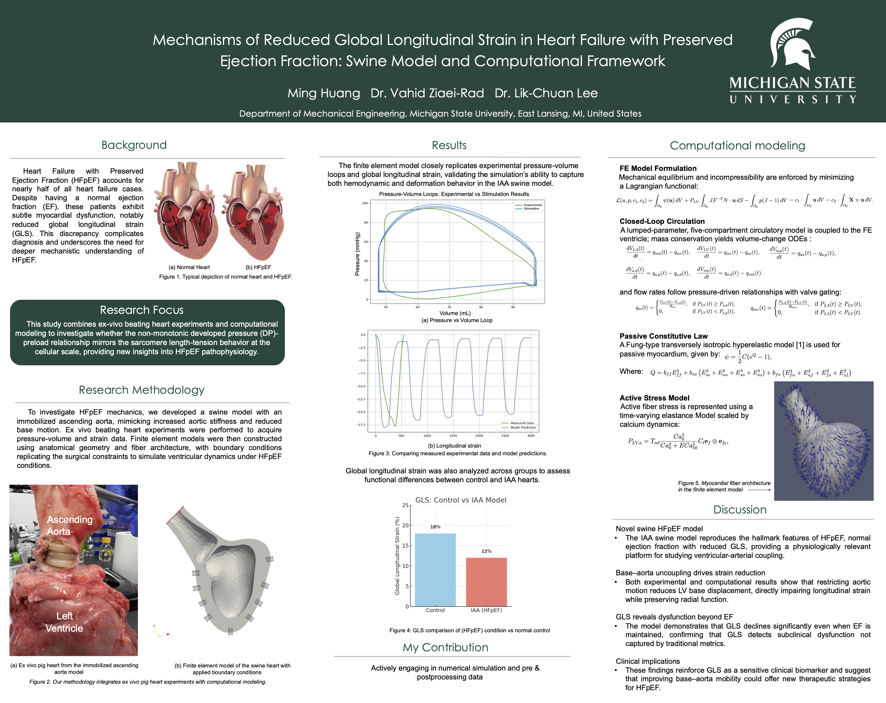

# Mechanisms of Reduced Global Longitudinal Strain in HFpEF

**Undergrad Research Project**  
Advisors: Dr. Vahid Ziaei-Rad, Dr. Lik-Chuan Lee  
Institution: Michigan State University  

## Summary
This project investigates the mechanisms underlying reduced global longitudinal strain in heart failure with preserved ejection fraction, a condition where patients exhibit normal ejection fraction despite impaired myocardial function.

The study combines ex vivo swine heart experiments with a finite element computational framework to examine how altered ventricular–arterial coupling affects cardiac deformation.

## Approach
- Ex vivo beating-heart experiments using a swine HFpEF model
- Pressure–volume and strain measurements under controlled conditions
- Finite element modeling of ventricular mechanics with closed-loop circulation
- Comparison of experimental data with simulation results

## Key Findings
- The computational model reproduces experimental pressure–volume loops and strain behavior
- Reduced GLS emerges despite preserved ejection fraction
- Results suggest base–aorta uncoupling as a key contributor to impaired longitudinal strain

## Impact
This work provides mechanistic insight into HFpEF pathophysiology and highlights GLS as a sensitive indicator of subclinical myocardial dysfunction beyond traditional ejection fraction metrics.

## Poster
