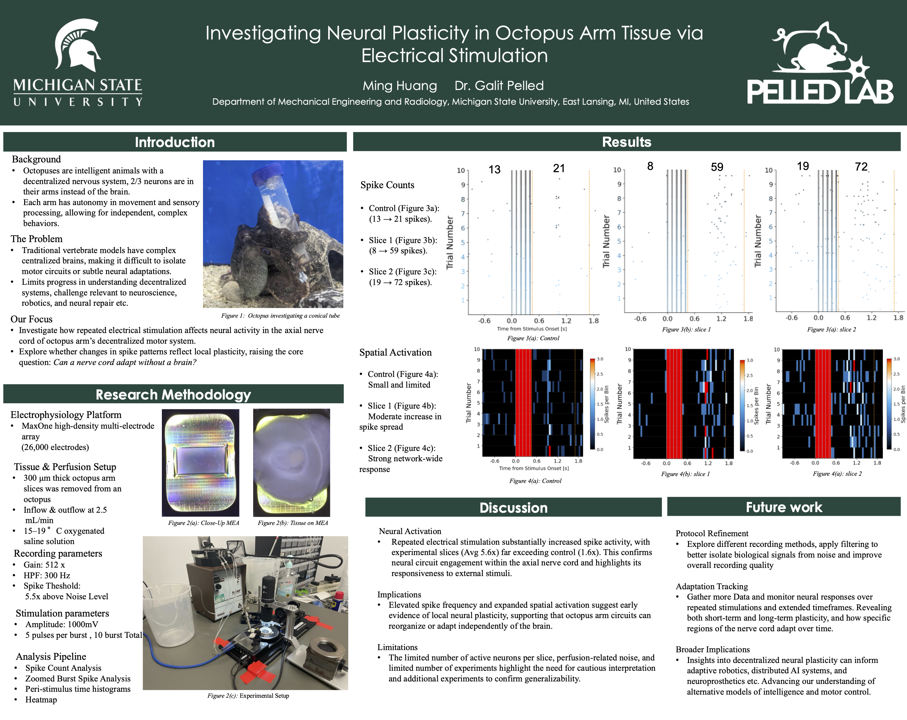

# Investigating Neural Plasticity in Octopus Arm Tissue

**Undergraduate Research Project**  
Advisor: Dr. Galit Peled  
Institution: Michigan State University  

## Summary
This research investigates how repeated electrical stimulation affects neural activity in isolated octopus arm tissue. Octopus arms contain a highly decentralized nervous system, making them a unique model for studying local neural plasticity independent of a central brain.
Using high-density electrophysiology recordings, we examined whether repeated stimulation leads to increased spike activity and expanded spatial activation within the axial nerve cord.

## Approach
- Ex vivo octopus arm tissue preparation and perfusion
- Electrical stimulation of the axial nerve cord
- High-density multi-electrode array recordings (26,000 electrodes)
- Spike count and spatial activation analysis across repeated trials

## Key Findings
- Repeated stimulation produced substantial increases in spike activity compared to control conditions
- Neural responses became stronger and more spatially distributed over time
- Results suggest early evidence of local neural plasticity within the octopus arm

## Impact
This work contributes to understanding decentralized neural systems and has implications for neuroscience, adaptive robotics, and biologically inspired control architectures.

## Poster
