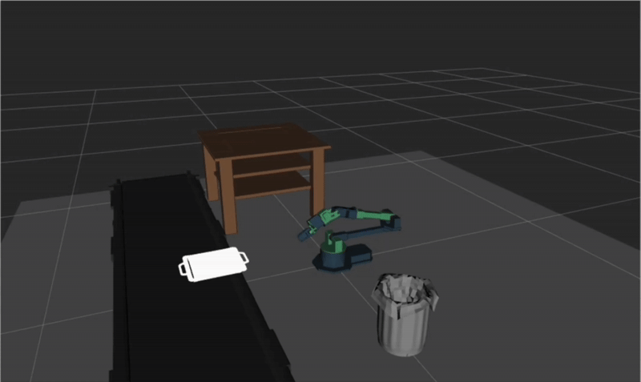

# 6-DOF Robotic Arm Pick-and-Place Manipulation

## Overview
A simulated 6-DOF robotic arm system that performs autonomous pick-and-place tasks using inverse kinematics, joint-space motion planning, and trajectory execution in ROS and Gazebo.

## Task
The robot executes pick-and-place manipulation for multiple objects (tray, can, wallet):
- Moves to predefined pickup poses
- Grasps the object
- Transports it to a target location
- Releases the object at the drop-off pose

This is a complete manipulation pipeline, not just end-effector pose reaching.

## Approach
- Inverse kinematics to convert Cartesian end-effector goals to joint configurations
- Collision-free joint-space planning using a precomputed probabilistic roadmap (PRM) with A* search
- Joint-space trajectory execution with PID-based joint control
- Task-level logic to sequence pick, move, and place actions

## Tools
- ROS, Gazebo, MoveIt(robot model, kinematics, visualization)

## Demo

### Code available upon request
