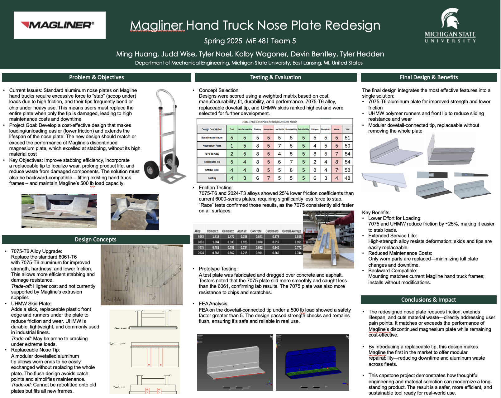

# Magliner Hand Truck Nose Plate Redesign

**Industry-Sponsored Capstone Project**  
Sponsor: Magline, Inc.  
MSU Mechanical Engineering Capstone  

## Summary
Redesigned the nose plate of a Magliner hand truck to reduce user effort during loading, extend product lifespan, and lower maintenance costs. The design addresses the performance gap left by Magline’s discontinued magnesium nose plate while remaining cost-effective and compatible with existing frames.

## Key Contributions
- Evaluated alternative materials and modular concepts to reduce sliding friction
- Designed a replaceable dovetail-connected nose tip to localize wear
- Validated performance through friction testing and finite element analysis
- Delivered a modular, backward-compatible design meeting Magline’s 500 lb load requirement

## Poster

